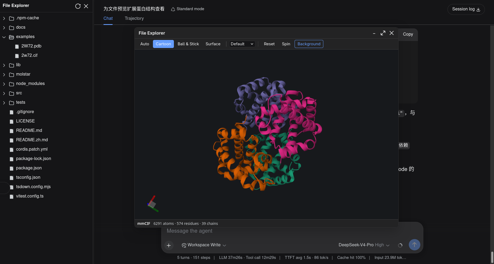
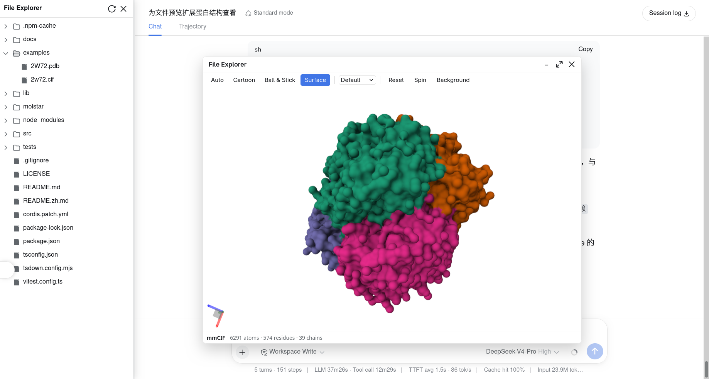

# dsh-file-explorer-preview-molstar

[English](README.md) | 中文

为 [dsh-file-explorer](https://github.com/wolfsonliu/dsh-file-explorer) 增加 **Mol\* 3D 结构查看器** 的 [DSH Web](https://deepseek.com) 插件，覆盖其对蛋白质结构与小分子文件的纯文本预览。

在文件浏览器里选中 `.cif` / `.pdb`（或下列任意支持格式），预览面板即渲染可交互的 3D 模型，而非原始文本。

## 截图

| 深色主题 | 浅色主题 |
| --- | --- |
|  |  |

## 特性

- 基于 [`molstar`](https://www.npmjs.com/package/molstar) 的 **3D 查看器**（`PluginContext` + 极简 canvas，不带完整 Mol\* UI）。
- **表示预设**：自动 / 卡通 / 球棍 / 分子表面。
- **着色**：默认 / 按链 / 按实体；**复位视角**、**旋转开关**、跟随 DSH `data-ds-dark-theme` 的**深浅背景**。
- **状态栏**：格式徽标 + 原子/残基/链计数。
- 工具条与状态栏文案**双语**（中文 / English）。
- **大文件与二进制**：超过核心 2 MiB 文本上限的文件（dsh-file-explorer v0.3.0 起以 `text-large` 类型返回）与 `.bcif`，通过核心 `fileExplorer.readRawFile` 拉取原始字节（dsh-file-explorer v0.1.0+ 标准特性）。

## 支持的格式

| 扩展名 | 格式 |
|--------|------|
| `cif` `mmcif` `mcif` | mmCIF |
| `bcif` | BinaryCIF |
| `pdb` `ent` | PDB |
| `pdbqt` | PDBQT |
| `pqr` | PQR |
| `sdf` `sd` | SDF |
| `mol` | MOL |
| `mol2` | MOL2 |
| `xyz` | XYZ |
| `gro` | GRO |

## 安装

### 从 Git 仓库安装

```sh
dsh plugin --profile web add github:wolfsonliu/dsh-file-explorer-preview-molstar
dsh web
```

### 从源码安装

```sh
git clone https://github.com/wolfsonliu/dsh-file-explorer-preview-molstar
cd dsh-file-explorer-preview-molstar
npm install
npm run build
dsh plugin --profile web add .
dsh web
```

## 依赖

本插件**依赖** [`@dsh-external/dsh-file-explorer`](https://github.com/wolfsonliu/dsh-file-explorer) —— 它注入 `fileExplorer` cordis 服务（`registerPreview` / `writeFile` / `readRawFile`）。请先安装并启用 `dsh-file-explorer`：

```sh
# 从 git 安装核心
dsh plugin --profile web add github:wolfsonliu/dsh-file-explorer

# 或，从源码安装
git clone https://github.com/wolfsonliu/dsh-file-explorer
cd dsh-file-explorer
npm install && npm run build
dsh plugin --profile web add .
```

> 本地开发时，本仓库的 `devDependencies` 用于让 `tsc` 解析 `@dsh-external/dsh-file-explorer` 的 `./client` 类型定义。`npm install` 前请将其指向你自己的 checkout（或 registry 上发布的包）。

≤ 2 MiB 的文件插件直接解析 `text` 预览内容。更大的文本文件（v0.3.0 起为 `text-large`）与 `.bcif` 通过 `readRawFile` 获取原始字节——这是 dsh-file-explorer v0.1.0+ 中 `FileExplorerService` 契约的标准组成部分（v0.3.0 未变更）。

## 限制

- 需要支持 **WebGL** 的浏览器。
- 只读预览（不支持编辑）。
- 轨迹与密度图（`.dcd`、`.nc`、`.map`）不在范围内。

## 开发

```sh
npm run check   # tsc 类型检查
npm test        # vitest 单元测试
npm run build   # tsc + tsdown（单文件 lib/client.js，内联 molstar）
```

真实 WebGL 挂载无法在 jsdom 下运行；请用 `dsh web` 配合 `examples/` 里的结构文件做冒烟验证。

> `npm run build` 后请硬刷新浏览器（`Ctrl/Cmd+Shift+R`）：`dsh web` 可能仍缓存旧的插件 bundle，软刷新用不到最新构建。

## 致谢

本插件基于 [**Mol\***](https://molstar.org)（`/ˈmol-star/`）构建——面向（不仅限于）大分子结构数据的下一代技术栈，由 [PDBe](https://www.ebi.ac.uk/pdbe/) 与 [RCSB PDB](https://www.rcsb.org/) 联合发起。

**使用 Mol\* 时，请引用：**

> David Sehnal, Sebastian Bittrich, Mandar Deshpande, Radka Svobodová, Karel Berka, Václav Bazgier, Sameer Velankar, Stephen K Burley, Jaroslav Koča, Alexander S Rose: *Mol\* Viewer: modern web app for 3D visualization and analysis of large biomolecular structures*, Nucleic Acids Research, 2021; https://doi.org/10.1093/nar/gkab314.

## License

[MIT](LICENSE)
